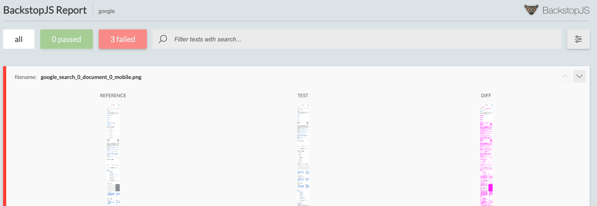
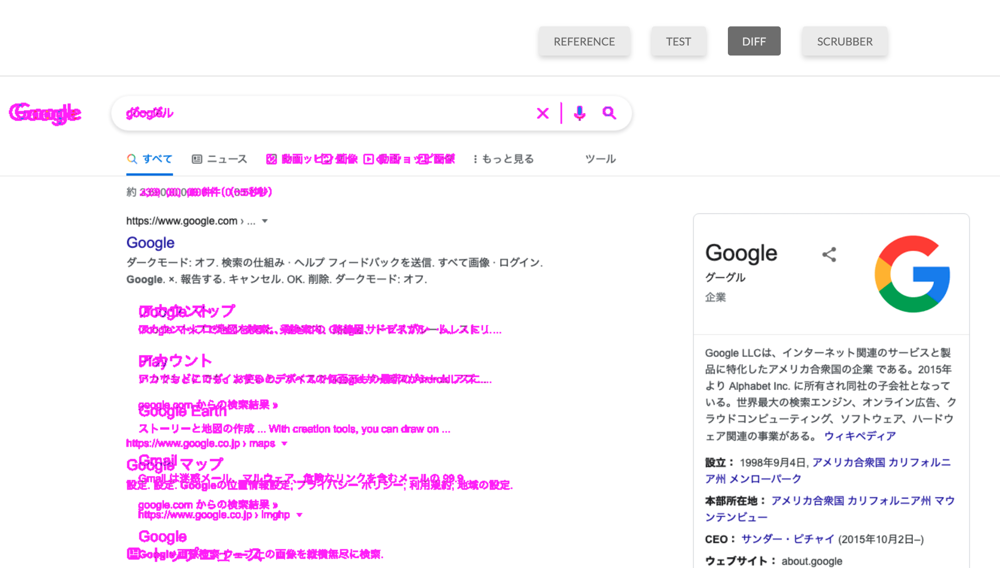

# VRT-BackstopJS

Visual Regression Testing by BackstopJS





***thanks***

* [BackstopJS](https://github.com/garris/BackstopJS)
* [puppeteer](https://github.com/puppeteer/puppeteer)

## これは何？

BackstopJSを用いたビジュアル回帰テスト環境です。

macOS、npm 8.3.0で動作を確認しています。


**mobile,tablet,PCのViewPortを設定済みです。**

対象画面サイズは

* [pc](https://gs.statcounter.com/screen-resolution-stats/desktop/japan)
* [tablet](https://gs.statcounter.com/screen-resolution-stats/tablet/japan)
* [mobile](https://gs.statcounter.com/screen-resolution-stats/mobile/japan)

のシェアNo.1(今日現在)を基準に設定。

* mobile: iPhone6,7,8,SE2相当
* tablet: iPad,iPad2相当

**lazyloadを切って、1secウェイトで画像をロードします。**

[onReady.js](backstop_data/engine_scripts/puppet/onReady.js)にて設定


## どんな人向け？

* 手っ取り早くChromeでURL開いた時のデザイン崩れだけ見れればいい。
何もないよりマシ。

* ちょっとCLIくらいなら打ち込めるという非エンジニア

* とりあえずお試しエンジニア

というライト層方向け。


※BackstopJS自体はCD/CIに組み込んだり、連携機能の多い、使い勝手のいいパワフルなツールです。

このリポジトリは導入用です。ご自身で調べて育てることで素敵になると思います。


## 使い方

* 導入

npmが導入されていること。導入方法はググったり、開発者に聞いてください。

```sh
$ git clone git@github.com:nb-katsuyuki/VRT-BackstopJS.git
$ cd VRT-BackstopJS
$ npm install
```

* 設定

設定ファイル [backstop.json](backstop.json)

確認したいURLを指定
```json
34:      "url": "https://www.google.com/search?q=google",
35:      "referenceUrl": "https://www.google.com/search?q=%E3%82%B0%E3%83%BC%E3%82%B0%E3%83%AB",
```

* 基準(リファレンス)を作成

```sh
$ npm run reference
```

* 比較＆レポート

```sh
$ npm run diff
```

* 比較内容を許容（リファレンスに反映）

```sh
$ npm run commit
```

以後、diffとcommitを繰り返す


## こういう時はどうすれば？

---

Q. 違うデバイスや画面サイズを指定したい。

A. [devices](https://github.com/puppeteer/puppeteer/blob/main/src/common/DeviceDescriptors.ts)を参照して[ここ](backstop.json)のviewで指定。

---

Q. 複数の画面もチェックしたい。

A. 設定ファイル [backstop.json](backstop.json)の`scenarios`に設定を増やせばOK

```json
   "scenarios": [
    {
      "label": "search",
      "cookiePath": "backstop_data/engine_scripts/cookies.json",
      "url": "https://www.google.com/search?q=google",
      "referenceUrl": "https://www.google.com/search?q=%E3%82%B0%E3%83%BC%E3%82%B0%E3%83%AB",
        ...

    },
    {
      "label": "other page",
      "cookiePath": "backstop_data/engine_scripts/cookies.json",
      "url": "https://other.page",
      "referenceUrl": "https://other.page",
      ...
    },
    ...
  ],

```

---

Q. 画面に動的な部分(広告)などは差分を出したくない。

A.  設定ファイル [backstop.json](backstop.json)の`scenarios`に`hideSelectors`や`removeSelectors`がありますので、対象セレクタを指定します。

```json
39:      "hideSelectors": [".hideClassName","#hideId"],
40:      "removeSelectors": [".removeClassName","#removeId"],
```

---


Q. jsよりrubyが得意なんだけど。puppeterを使いたくない。

A. puppeterではなく、playwrightも使用できます。

[backstop.json](backstop.json)

↓を書き換え

```json
59:  "engine": "puppeteer",
```

※このリポジトリではdeviceやlayzyloadなどはpuppeteerにしか対応していません。


他にも[casper](https://github.com/casperjs/casperjs)や[chromy][https://github.com/OnetapInc/chromy]を導入することもできます。

ググると幸せが訪れると思います。

---

Q. 画像が表示されない。デザインが崩れる。

A. リソースのロードに時間がかかっているのかも。ディレイなどをれてみると解決するかも。

[backstop.json](backstop.json)

```
38:       "delay": 0,
```

[onReady.j](backstop_data/engine_scripts/puppet/onReady.js)

```
23:  await page.waitForTimeout(1000);
```

---

Q. 他の人と設定を共有したい場合、どのファイルを共有すればいい？

A. 最低限[backstop.json](backstop.json)だけ共有できれば大丈夫。

基準となるキャプチャ[backstop_data/bitmaps_reference/](backstop_data/bitmaps_reference/)を共有するとreferenceをする必要がなくなります。

エンジンの動作などを変更していたらそれらも。

---

Q.  結果のレポートはどこにあるの？

A. [backstop_data/html_report](backstop_data/html_report/)にあります。

---

Q. ディスクを圧迫するのだけど

A. [backstop_data/bitmaps_test](backstop_data/bitmaps_test/)はいつ消してしまって大丈夫。

---

Q. CIとして組み込みたい。CLIではなくブラウザから許容の可否を決めたい。他にも実現したいことがある。こんなことが出来るのか確認したい。

A. Issueを上げてもらえると、もしかしたら応えられるかも。

公式ドキュメンや[BackstopJS](https://github.com/garris/BackstopJS),[puppeteer](https://github.com/puppeteer/puppeteer)、ググったりすると幸せになれるのではないでしょうか:)


共有・コラボレーションしてもらえると幸いです。


## 最後に

VRTの選定はしていたのですが、

必要に迫られて、機能・性能はそれなりでもすぐローカルで気軽に使えるものとしてBackstopJSを採用。

「機能・性能はそれなり」とか書きましたが、使いこなせば強力に利用できる懐の深さを感じます。


現時点の、私の課題感としては、

要素の縦ズレ(ページの間に要素を入れるなど)も素直に差分にしてしまうのをもう少しスマートにしたいところ。

設定でどうにかなるのか、画像比較モジュールを差し替えればなんとかなるのか・・・

何かあればIssueお願いします。
